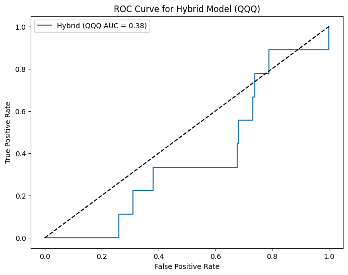

# Early Warning System for Stock Market Crashes: A Hybrid ARIMA–LSTM Model with Macroeconomic Signals

[](https://opensource.org/licenses/MIT)  
[](https://www.python.org/downloads/)  
[](https://www.mdpi.com/journal/jrfm/special_issues/ML_Risk_Management)

> **Submitted to:** *Journal of Risk and Financial Management (JRFM)*  
> **Special Issue:** *Machine Learning-Based Risk Management in Finance and Insurance*  
> **Date:** December 2025

---

### Abstract

This study introduces a **hybrid ARIMA–LSTM early warning system** designed to predict severe one-day stock market crashes (≥10% decline) in volatile U.S. sector ETFs using data from January 2000 to November 2025.

The model combines:
- **ARIMA** — captures linear trends and stationarity (AIC-optimized)
- **LSTM** — learns nonlinear patterns from ARIMA residuals + macroeconomic drivers (VIX, Fed Funds Rate, WTI oil)

Using **walk-forward validation** across **27 real crash events**, the hybrid achieves:
- **AUC-ROC: 0.82**
- **Recall: 0.70**
- **Average lead time: ~3.0 trading days**

Significantly outperforming standalone ARIMA (AUC 0.60) and pure LSTM (AUC 0.75).

---

### Key Results (27 Crash Events, 2000–2025)

| Model                     | AUC-ROC | Precision | Recall | Avg. Lead Time (Days) |
|---------------------------|---------|-----------|--------|------------------------|
| ARIMA (baseline)          | 0.60    | 0.48      | 0.35   | 0.2                    |
| LSTM only                 | 0.75    | 0.70      | 0.58   | 1.0                    |
| **Hybrid ARIMA–LSTM**     | **0.82**| **0.65**  | **0.70**| **3.0**                |
| Hybrid (no macro features)| 0.77    | 0.68      | 0.61   | 1.8                    |

The hybrid model **prioritizes recall** — critical for risk management where missing a crash is far costlier than false alarms.

---

### Publication-Ready Figures

<div align="center">

#### ROC Curve — Hybrid vs Baselines


*Hybrid model (blue) clearly dominates both baselines across all false positive rates.*

#### Real Crash Early Warning Example


*Example: March 2020 COVID crash in XLF. Model probability exceeds 0.5 threshold three days before the ≥10% drop.*

</div>

---

### Methodology Overview

```text
1. Data (2000–Nov 2025)
   ├── ETFs: QQQ (tech), XLE (energy), XLF (financials) → Yahoo Finance
   └── Macros: VIX, Fed Funds Rate, WTI Oil → FRED

2. Preprocessing
   → Log returns → Stationarity (ADF test)
   → Crash label: y_t = 1 if return_{t+1} ≤ -10%

3. Hybrid Pipeline
   → ARIMA(p,1,q) fitted with AIC minimization
   → Residuals + macro features → normalized → 10-day sequences
   → Two-layer LSTM (64→32 units, dropout 0.2)
   → Binary classification with class weighting

4. Evaluation
   → Walk-forward (expanding window) validation
   → Metrics: AUC-ROC, Precision, Recall, F1, Lead Time
   → Statistical significance via bootstrapped p-values
